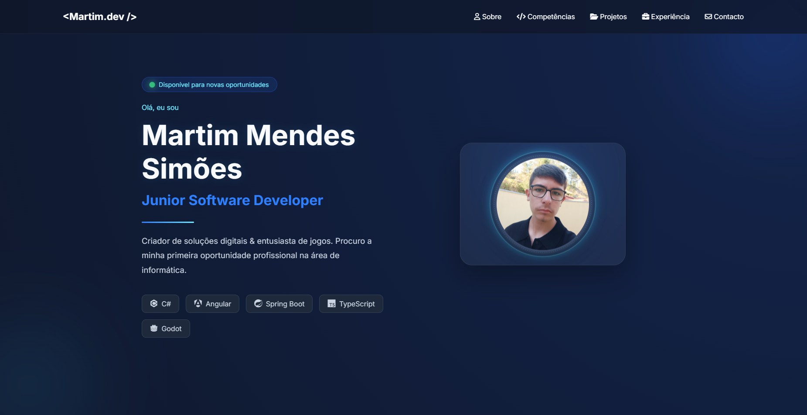

# Martim Mendes Simões – Portfolio

[](https://github.com/MINEGAMERPTyt/portfolio)
[](https://github.com/MINEGAMERPTyt/portfolio)
[](https://github.com/MINEGAMERPTyt/portfolio)
[](https://github.com/MINEGAMERPTyt/portfolio)

> Personal portfolio website built with HTML, CSS, and JavaScript.  
> Showcases my skills, projects, and professional experience as a junior software developer.



---

## Live Website

[**martimsimoes-portfolio.netlify.app**](https://martimsimoes-portfolio.netlify.app)

---

## About This Project

This is a **modern, responsive, and fully static portfolio** designed to present my work, technical skills, and professional background. It was built from scratch with a focus on:

- Clean, minimalist UI with a dark glassmorphism aesthetic
- Smooth scroll animations and subtle interactions
- Full responsiveness (mobile, tablet, desktop)
- Custom cursor set (Neon Blue style)
- Contact form integrated with EmailJS
- Project showcase with dynamic content loading

---

## Built With


---

## Project Structure

```
Portfolio/
├── assets/
│   ├── css/
│   │   ├── animations.css
│   │   ├── about.css
│   │   ├── contact.css
│   │   ├── experience.css
│   │   ├── footer.css
│   │   ├── hero.css
│   │   ├── navbar.css
│   │   ├── projects.css
│   │   ├── responsive.css
│   │   ├── skills.css
│   │   ├── style.css
│   │   └── variables.css
│   ├── cursors/              # Custom cursor files (.cur)
│   ├── files/
│   │   └── CV_Martim_Mendes_Simoes.pdf
│   ├── images/
│   │   ├── profile/          # Profile pictures
│   │   └── projects/         # Project screenshots
│   └── js/
│       ├── main.js           # Core logic (projects, observers)
│       ├── navbar.js         # Navbar scroll & hamburger menu
│       ├── scroll.js         # Parallax effects
│       └── contact.js        # EmailJS form handling
├── index.html
├── README.md
└── .gitignore
```

---

## Features

- **Responsive navigation** - collapsible hamburger menu on mobile
- **Scroll progress bar** - visual indicator at the top of the page
- **Parallax effect** - subtle movement on the hero section
- **Dynamic project viewer** - click a project to see details, tech stack, and preview
- **EmailJS contact form** - sends messages directly to my inbox with feedback messages
- **Custom cursors** - consistent and themed cursor experience
- **Smooth reveal animations** - elements fade and slide in as you scroll

---

## How to Run Locally

1. Clone the repository:
   ```bash
   git clone https://github.com/MINEGAMERPTyt/portfolio.git
   ```
2. Open the project folder:
   ```bash
   cd portfolio
   ```
3. Open `index.html` in your browser (double-click or use Live Server in VS Code).

No build step or dependencies required – it's pure static HTML/CSS/JS.

---

## Contact

If you'd like to collaborate, have any questions, or just want to say hello:

- **Email**: [martimjorge75@gmail.com](mailto:martimjorge75@gmail.com)
- **LinkedIn**: [Martim Simões](https://linkedin.com/in/martim-simoes-a9a2482b1)
- **GitHub**: [MINEGAMERPTyt](https://github.com/MINEGAMERPTyt)

---

## License

This project is open source and available under the [MIT License](LICENSE).  
You are free to use, modify, and distribute it – but please keep the original credits.

---

## Acknowledgements

- [EmailJS](https://www.emailjs.com/) – for the contact form service
- [Font Awesome](https://fontawesome.com/) – icons
- [Devicon](https://devicon.dev/) – technology icons
- [Google Fonts](https://fonts.google.com/) – Inter font

---

## About the Developer

I'm a junior software developer passionate about building clean, functional, and beautiful digital experiences. This portfolio is a reflection of my journey so far – and I'm always learning and improving.

---

*Last updated: August 2026*